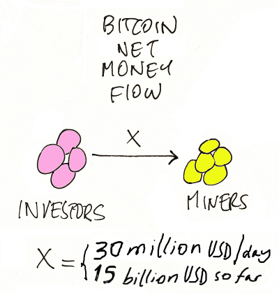

# Yes, Bitcoin Is a Ponzi - Learn How the Investment Fraud Works

> SEC Investor Education:
>
> New Year's Financial Resolution: Avoid too-good-to-be-true "investments" with Ponzi scheme "red flag" claims like:
>
> - "To the moon! To the mars!"
> - "Number go up!"
> - "Yearly return of 300+% in 2020!"
> - "Could quadruple in 2021 and rally to $100,000!"

A collection of "unpopular opinion" and get-rich-quick party spoiler "stop the music" articles on "Is Bitcoin a Ponzi? Is Bitcoin a Speculative Bubble? Is Bitcoin a Digital 21st Century Tulip Mania? Is Bitcoin Comedy Gold?"

From the Wikipedia:

Bitcoin has been described as an economic bubble by at least eight Nobel Prize Economists at various times, including Robert Shiller on 1 March 2014, Joseph Stiglitz on 29 November 2017, and Richard Thaler on 21 December 2017. On 29 January 2018, a noted Keynesian economist Paul Krugman has described bitcoin as "a bubble wrapped in techno-mysticism inside a cocoon of libertarian ideology", on 2 February 2018, professor Nouriel Roubini of New York University has called bitcoin the "mother of all bubbles", and on 27 April 2018, a University of Chicago economist James Heckman has compared it to the 17th-century tulip mania.

On 4 December 2013, Alan Greenspan referred to it as a "bubble" as did George Soros on 25 January 2018. Warren Buffett called bitcoin a "mirage" on 13 March 2014.

§

Some "unpopular" bitcoin facts:

- Bitcoin Proof-of-Waste Mining Is an Environmental Disaster
- Bitcon Is a Greater Fool BagHODLer Zero-Sum Fraudsters' Greed Fest
- The Bigger the Lies the Better - To the Moon! Number Go Up! Will Quadruple to $100 000 in 2021!
- Bitcoin Is Comedy Gold - Bitcoin Is the New Standard?! - LOL
- When Will the Music Stop? (Hint: Try to Cash Out)

Or how about:

> Bitcoin's money flow is exactly the same as that of a ponzi scheme, as depicted above.
> The arrow in that diagram represents the net one-way flow of money from investors to miners. 
> The net total flow since 2009 is already 15 billion USD. 
> If the the current bitcoin (BTC) price holds, that amount will grow by about 30 million USD/day, 
> or at least another 10 billion USD in the next year. 
> Besides the investors, there isn't (and there will never be) any source of money that could return that money to them.
>
> Even if bitcoin promoters refuse to accept the label "ponzi", 
> they cannot deny that diagram. How can anyone propose such a bottomless barrel as a "store of value".
>
> -- [Jorge Stolfi, Yes, Bitcoin is a Ponzi: A Re-Rebuttal](https://www.ic.unicamp.br/~stolfi/bitcoin/2021-01-16-yes-ponzi.html)

So what!?  Do your own research! Here we go:

**SCAM ALERT! SCAM ALERT! SCAM ALERT!**

### Tyler Winklevoss, Bitcoin Billionaire

> Washington Post News:
>
> Bitcoin surges past $20 000 for first time.

This Bitcoin rally is the most sophisticated investors, the smartest people in the room, buying the bitcoin quietly. Number go up! To the moon!

§

When Elon Musk puts the Tesla balance sheet into Bitcoin, we'll have to change the Bitcoin rallying cry from "to the moon!" to "to Mars!"

> Austrian Maximalist comments: Let's use solar energy to mine bitcoin with
>  satellites in space!

§

The U.S. Dollar is no longer a reliable store of value. Cameron and I (Winklevoss Twins Capital) make the case for $500 000 Bitcoin. Number go up! To the moon!

### Cameron Winklevoss, Bitcoin Billionaire

There are 3.5 billion smart phones on the planet. All of them can hold bitcoin. None of them can hold gold. Bitcoin is the future. Number go up! To the moon!

### Michael Saylor, Business Intelligence Billionaire

Money is energy. Bitcoin is the first crypto monetary energy network, capable of collecting all the world's liquid energy, storing it over time without power loss, and channeling it across space with negligible impedance. Number go up! To the moon!

> Austrian Maximalist comments: And it's all represented in this: 21,000,000.00000000

> Austrian Physicist comments: The science on this is legit respecting the laws of thermodynamics.

### Anthony Pompliano, Bitcoin Cheerleader, Off The Chain Investment Newsletter Writer (100 000+ Subscribers)

There are an increasing number of buyers, yet a decreasing amount of available Bitcoin.

Any economics 101 student can predict what happens next. To the moon! Number go up!

### Bitcoiner (BTC), Greater Fool Investor

WOO NUMBER GO UP!!!

Who needs adoption when you can have institutional investors!
Why bank the unbanked when you can bank the banks!
Bring out the champaign because NUMBER GO UP!!!

Am I price posting right?

### Dan McArdle,  Bitcoin "There is No Alternative", Bitcoin is the New (Gold) Standard

Bitcoin will save the environment. 
Bitcoin will create a global arbitrage in energy. 

Bitcoin will drive innovation in energy and use of renewables.

§

Bitcoin number go up because more people want bitcoin.
Bitcoin becomes more and more valuable.

- 1,000 HODLers
- 10,000 HODLers
- 100,000 HODLers
- 1,000,000 HODLers
- 10,000,000 HODLers
- 100,000,000 HODLers
- 1,000,000,000 HODLers
- 10,000,000,000 HODLers
- 100,000,000,000 HODLers and on and on

People will come to understand bitcon.

---

Comedy Gold?  Let's get real:

## 2021

[**Yes, Bitcoin is a Ponzi: A Re-Rebuttal**](https://www.ic.unicamp.br/~stolfi/bitcoin/2021-01-16-yes-ponzi.html)
by Jorge Stolfi, Computer Sciencist, State University of Campinas, Brazil

[**Bitcoin is not a means of payment. Bitcoin is not a currency. Bitcoin is not a unit of account. Bitcoin is not a scalable means of payment. Bitcoin is not a single numeraire. Now, people say Bitcoin is an asset. But think of it. What are assets?**](https://amycastor.com/2021/02/11/nouriel-roubini-tether-is-a-criminal-enterprise-sec-should-probe-elon-musks-bitcoin-tweets/)
by Nouriel Roubini, Economist, Coin Desk Q&A, (transcribed by Amy Castor - thanks!)

[**Bitcoin is not a hedge against tail risk. Elon Musk may be buying it, but that doesn't mean everyone else should follow suit. The fundamental value of bitcoin is negative given its massive environmental cost**](https://www.ft.com/content/9be5ad05-b17a-4449-807b-5dbcb5ef8170) by Nouriel Roubini, Economist, Finincial Times Op-Ed

[**'How can $24B in tethers move a $650B Bitcoin market cap?' and other mathematically illiterate question**](https://amycastor.com/2021/01/20/how-can-24b-in-tethers-move-a-650b-bitcoin-market-cap-and-other-mathematically-illiterate-questions/) by Amy Castor, Blockchain Journalist 

[**If You Buy Bitcoin, You'll Get Screwed**](http://www.tr0lly.com/bitcoin/buy-bitcoin-get-screwed/) by Trolly McTrollface

[**The Stupidity of Investing in Bitcoin**](http://www.tr0lly.com/bitcoin/the-stupidity-of-investing-in-bitcoin/)  by Trolly McTrollface

[**Tether: Heads I Win, Tails You Lose**](http://www.tr0lly.com/uncategorized/tether-heads-i-win-tails-you-lose/)  by Trolly McTrollface

[**The Tether Press and Bitcoin's Speculative Mania**](http://www.tr0lly.com/bitcoin/the-tether-press-and-bitcoins-speculative-mania/)
by Trolly McTrollface

[**Tesla Spends $1.5B of Taxpayer-Funded Environmental Credits to Burn Coal in China**](http://www.tr0lly.com/bitcoin/tesla-spends-1-5b-of-taxpayer-funded-environmental-credits-to-burn-coal-in-china/) by Trolly McTrollface

[**Bitcoin consumes 'more electricity than Argentina'. The rising value of Bitcoin leads to ever-higher energy consumption**](https://www.bbc.com/news/technology-56012952) by Cristina Criddle, Tech Reporter, British Broadcasting Corp. (BBC)

[**Inside the Cryptocurrency Casino: Bitcoin and its imitators were supposed to democratize the world of money. Instead, speculators have gotten rich - and the planet is paying the price**](https://www.currentaffairs.org/2021/02/inside-the-cryptocurrency-casino) by Andrew Ancheta, Current Affairs

[**The Bit Short: Inside Crypto's Doomsday Machine**](https://crypto-anonymous-2021.medium.com/the-bit-short-inside-cryptos-doomsday-machine-f8dcf78a64d3) by Crypto Anonymous

[**"I don't believe bitcoin is unique in any way": Why investors should be careful with this cryptocurrency**](http://usatoday.com/story/money/columnist/2021/01/10/investors-cryptocurrency-bitcoin/43312105/) by Sean Williams, Investment Advisor, The Motley Fool

## 2020

[**Why Bitcoin is a Ponzi: A Type of Investment Fraud with Five Features**](https://www.ic.unicamp.br/~stolfi/bitcoin/2020-12-31-bitcoin-ponzi.html)
by Jorge Stolfi, Computer Sciencist, State University of Campinas, Brazil

[**Bitcoin is not a literal Ponzi scheme**](http://www.tr0lly.com/bitcoin/bitcoin-is-not-a-literal-ponzi-scheme/) by Trolly McTrollface

## 2019

[**Tether: The Story So Far**](https://www.kalzumeus.com/2019/10/28/tether-and-bitfinex/) by Patrick McKenzie, Recovering Japanese Salaryman

[**Up in Flames: Bitcoin and other digital coins recapitulate 500 years of failure**](https://arstechnica.com/information-technology/2019/02/researcher-counts-the-reasons-he-wants-cryptocurrency-burned-with-fire/) by Nicholas Weaver, Computer Scientist, University of California, Berkley, United States

[**There's No Good Reason to Trust Blockchain Technology**](https://www.wired.com/story/theres-no-good-reason-to-trust-blockchain-technology/) by Bruce Schneier, Cryptography Researcher

[**Chapter 1 - The Bitcoin Narratives (in Narrative Economics: How Stories Go Viral and Drive Major Economic Events)**](https://press.princeton.edu/books/hardcover/9780691182292/narrative-economics) by Robert Shiller, Yale University, Nobel Laureate Economist

## 2018

[**Bitcoin Maximalists' Impossible Dream**](https://www.forbes.com/sites/francescoppola/2018/12/30/bitcoin-maximalists-impossible-dream/) by Frances Coppola, Finance Journalist

[**Bitcoin and other cryptocurrencies are useless**](https://www.economist.com/leaders/2018/08/30/bitcoin-and-other-cryptocurrencies-are-useless), The Economist

[**Why bitcoin uses so much energy: Its consumption is roughly the same as Ireland's**](https://www.economist.com/the-economist-explains/2018/07/09/why-bitcoin-uses-so-much-energy), The Economist

[**Bitcoin is based on the blockchain pipe dream**](https://www.theguardian.com/business/2018/mar/05/bitcoin-is-based-on-the-blockchain-pipe-dream) by Nouriel Roubini, Economist and Preston Byrne, Blockchain Attorney

[**The Big Blockchain Lie**](https://www.project-syndicate.org/commentary/blockchain-big-lie-by-nouriel-roubini-2018-10) by Nouriel Roubini, Economist

[**Crypto is the Mother of All Scams and (Now Busted) Bubbles - While Blockchain Is The Most Over-Hyped Technology Ever, No Better than a Spreadsheet/Database**](https://bitsblocks.github.io/crypto-bubbles) by Nouriel Roubini, Economist

[**Crypto Facts - Decentralize Payments - Efficient, Low Cost, Fair, Clean - True or False?**](https://bitsblocks.github.io/crypto-facts) by Nouriel Roubini, Economist

[**Best of Bitcoin Maximalist - Scammers, Morons, Clowns, Shills & BagHODLers - Inside The New New Crypto Ponzi Economics**](https://bitsblocks.github.io/bitcoin-maximalist) by Trolly McTrollface

[**Bitcoin is basically a ponzi scheme**](https://www.seattletimes.com/opinion/bitcoin-is-basically-a-ponzi-scheme/)
by Paul Krugman, Nobel Laureate Economist

[**Greater fool theory - The bitcoin bubble**](https://www.economist.com/buttonwoods-notebook/2017/11/01/the-bitcoin-bubble), The Economist

[**Bitcoin is the greatest scam in history**](https://www.vox.com/2018/4/24/17275202/bitcoin-scam-cryptocurrency-mining-pump-dump-fraud-ico-value) by Bill Harris, Founding CEO, PayPal and Personal Capital

[**Why you can't cash out: Bitcoin is not a Ponzi scheme! It just works like one**](https://davidgerard.co.uk/blockchain/2018/01/04/why-you-cant-cash-out-pt-3-bitcoin-is-not-a-ponzi-scheme-it-just-works-like-one/) by David Gerard, Blockchain Journalist 

## 2017

[**The Problem with Calling Bitcoin a "Ponzi Scheme"**](https://prestonbyrne.com/2017/12/08/bitcoin_ponzi/) by Preston Byrne, Blockchain Attorney

[**Attack of the 50 Foot Blockchain**](https://davidgerard.co.uk/blockchain/table-of-contents/) by David Gerard, Blockchain Journalist

## 2016

[**On the dangers of a blockchain monoculture**](https://tonyarcieri.com/on-the-dangers-of-a-blockchain-monoculture) by Tony Arcieri, Blockchain Programmer

## 2015

[**The Death of Bitcoin**](https://tonyarcieri.com/the-death-of-bitcoin) by Tony Arcieri, Blockchain Programmer

## 1776

[**HODLing Gold? Gengis Khan is HODLing Sheep and Oxen: Inside the True Nature and Causes of the Wealth of Nations**](https://github.com/openblockchains/crypto-books/tree/master/The_Wealth_of_Nations) by Adam Smith, Old School Economist

---

Found another Bitcoin ponzi article? Tell us!

Contributions welcome! Just send pull requests.

---

Why?  This Bitcoin Is a Ponzi page is inspired
by the [Bitcoin Obituaries: Bitcoin Declared Dead 350+ Times](https://99bitcoins.com/bitcoin-obituaries/) page.

Austrian Maximalist comments: Can I ask, when will you admit you were wrong? $50 000 bitcoin? $100 000 bitcoin? $500 000 bitcoin?

